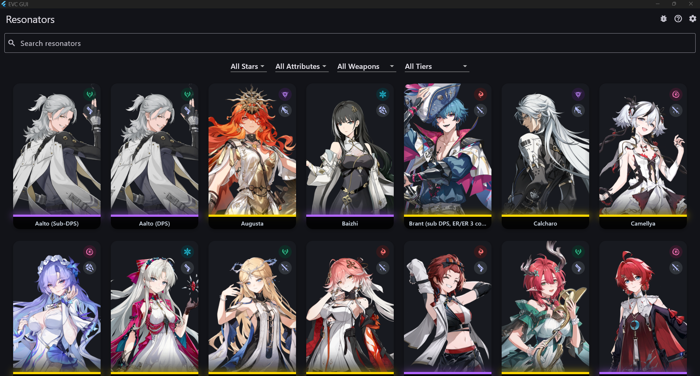
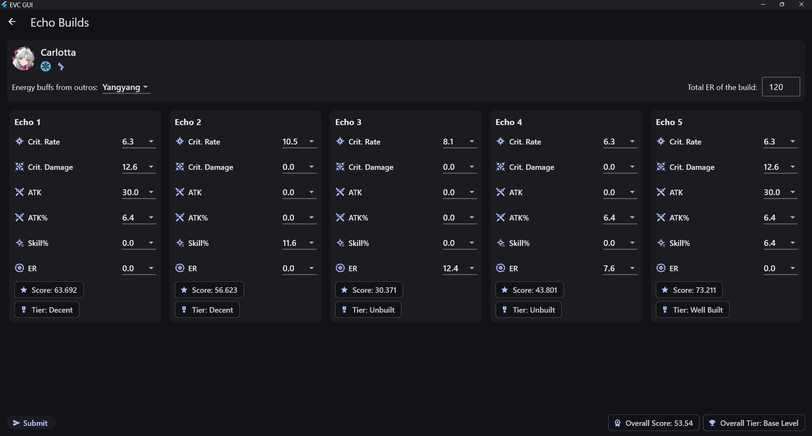

# EVC GUI

## About

I made this app because I use the Echo Value Calculator website a lot, but I really wanted a way to save echo presets; and honestly, the web UI could use some love. So I built a cross-platform Flutter app for it!

This was also my excuse to learn Flutter, so the code might be a bit messy. If you spot something weird, that's probably why.

Full credit goes to [AstyuteChick](https://github.com/AstyuteChick) for making the original calculator. This app just wraps their awesome backend with a friendlier UI, as well as echo saving functionality.

## How to Use

For instructions, just check out the [official guide](https://www.echovaluecalc.com/instruct) from the Echo Value Calculator website.

## Screenshots

Here’s what the app looks like:




## Getting Started

### Prerequisites

- [Flutter SDK](https://flutter.dev/docs/get-started/install)
- Dart 3.0+
- Compatible IDE (VS Code, Android Studio, etc.)

### Installation

1. **Clone the repository:**
   ```sh
   git clone https://github.com/phnthnhnm/evc.git
   cd evc
   ```
2. **Install dependencies:**
   ```sh
   flutter pub get
   ```
3. **Run the app:**
   - For mobile:
     ```sh
     flutter run
     ```
   - For desktop (Windows/macOS/Linux):
     ```sh
     flutter run -d windows
     flutter run -d macos
     flutter run -d linux
     ```
   - For web:
     ```sh
     flutter run -d chrome
     ```

## File Structure

```
lib/
	main.dart
	models/
	screens/
		settings/
			appearance_tab.dart
			data_tab.dart
			settings_screen.dart
			about_tab.dart
	services/
	utils/
	widgets/
assets/
	attributes/
	portraits/
	stats/
	weapons/
```

## Contributing

Contributions are welcome! Please open issues or submit pull requests for improvements and bug fixes.

1. Fork the repository
2. Create your feature branch (`git checkout -b feature/YourFeature`)
3. Commit your changes (`git commit -am 'Add new feature'`)
4. Push to the branch (`git push origin feature/YourFeature`)
5. Open a pull request

## License

This project is licensed under the GPL 3.0 License. See the [LICENSE](LICENSE) file for details.

## Acknowledgements

- [Echo Value Calculator by AstyuteChick](https://www.echovaluecalc.com)
- This app uses assets from the game Wuthering Waves by Kuro Games. EVC GUI is not affiliated with or endorsed by Kuro Games. All trademarks and copyrights belong to their respective owners.
